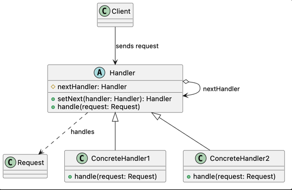

# Chain of Responsibility Pattern

## Intent

Chain of Responsibility passes a request through a sequence of potential handlers until one of them processes it or the end of the chain is reached.

This allows the sender to issue a request without knowing which object will handle it and enables the processing chain to be assembled or modified independently.

## Problem

A request may need to be processed by different objects depending on its data, state, or business rules.

Making the sender select a specific handler couples it to every available implementation. 
As new handlers are introduced, the sender becomes harder to modify, test, and maintain.

This problem commonly appears through:

* Large `if`, `else`, or `switch` blocks that select a handler.
* A sender that depends directly on multiple concrete handlers.
* Processing rules that must execute in a specific sequence.
* New handlers requiring changes to stable existing code.
* Business rules duplicated across different request flows.

## Solution

Chain of Responsibility extracts each processing rule into a separate handler and defines a common contract that every handler must implement.

Each handler maintains a reference to the next handler in the chain. 
When it receives a request, it decides whether to process it, forward it to the next handler, or perform both actions.

The client assembles the chain and sends the request to its first handler. 
Because every handler respects the same contract, handlers can be added, removed, reordered, or replaced without modifying the sender.

## Structure

* **Handler:** Defines the common contract for processing requests and referencing the next handler.
* **Concrete Handler:** Processes requests it is responsible for and forwards other requests through the chain.
* **Client:** Assembles the chain and sends requests to its first handler.
* **Request:** Contains the information that handlers inspect or process.

## Consequences

### Benefits

* The sender does not depend on a specific receiver.
* Handlers evolve independently from the client.
* The chain can be modified or reordered at runtime.
* New handlers can be introduced without modifying existing ones.
* Complex conditional selection logic is removed from the sender.
* Each handler can be tested independently.

### Trade-offs

* A request may reach the end of the chain without being handled.
* Processing behavior can be harder to trace across multiple handlers.
* The order of handlers may affect the final result.
* Long chains may introduce unnecessary processing overhead.
* Shared request data and forwarding rules require a well-designed contract.
