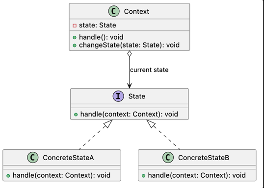

# State Pattern

## Intent

State allows an object to alter its behavior when its internal state changes by encapsulating state-specific behavior behind a common contract.

This makes the object appear to change its class at runtime while keeping state-dependent logic outside the context.

## Problem

An object may behave differently depending on its current internal state.

Placing every state and transition inside conditional blocks couples the object to all possible states. 
As new states and transitions are introduced, the class becomes harder to understand, modify, test, and maintain.

This problem commonly appears through:

* Large `if`, `else`, or `switch` blocks that inspect the current state.
* Multiple state-dependent behaviors implemented inside the same class.
* State-transition rules scattered across different methods.
* New states requiring changes throughout the context.
* Invalid operations being detected through repeated conditionals.
* A context that must understand the behavior of every possible state.

## Solution

State extracts state-specific behavior into separate objects and defines a common contract that every state must implement.

The context maintains a reference to its current state and delegates incoming operations to it. The context does not need to determine which behavior to execute through conditional logic.

Each concrete state implements the behavior associated with one particular state. A concrete state may also trigger a transition by replacing the current state held by the context.

Because all states respect the same contract, new states can be introduced without placing additional state-dependent behavior inside the context.

## Structure

* **Context:** Maintains a reference to the current State and delegates state-dependent operations to it.
* **State:** Defines the common contract for behavior associated with each possible state.
* **Concrete State:** Implements behavior for one specific state and may initiate a transition to another state.
* **Client:** Interacts with the Context without needing to know which Concrete State is currently active.

## Consequences

### Benefits

* State-specific behavior is separated from the context.
* Large conditional blocks based on state are eliminated.
* Each state can be tested independently.
* State transitions become explicit and localized.
* New states can be introduced with minimal changes to the context.
* Invalid operations can be handled directly by the relevant state.
* The context depends on a stable abstraction instead of every concrete state.

### Trade-offs

* Introduces additional objects and classes.
* Simple state machines may become unnecessarily complex.
* Transition logic may become distributed across multiple Concrete States.
* Understanding the complete state flow may require examining several classes.
* Concrete States may become coupled when they create or reference one another.
* Shared behavior between states may require an additional abstraction or duplication.
