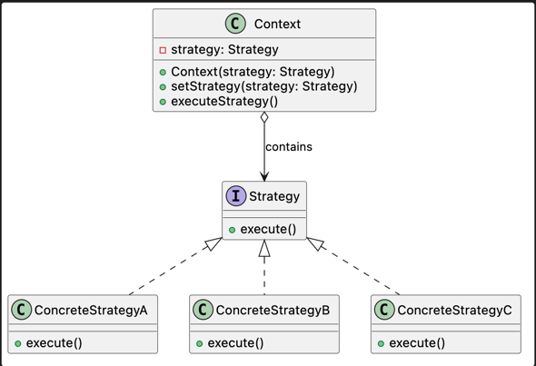

# Strategy Pattern

## Intent

Strategy defines a family of interchangeable algorithms, encapsulates each one behind a common contract, and allows an object to delegate behavior to the selected algorithm.

This enables behavior to vary independently from the object that uses it and allows the algorithm to be replaced at runtime.

## Problem

A class may need to perform the same operation using different algorithms or business rules.

Placing every variation inside conditional blocks couples the class to all available implementations. As new variations are introduced, the class becomes harder to modify, test, and maintain.

This problem commonly appears through:

* Large `if`, `else`, or `switch` blocks that select behavior.
* Multiple algorithms implemented inside the same class.
* Business rules duplicated across the system.
* New variations requiring changes to stable existing code.
* A client that depends directly on multiple concrete implementations.

## Solution

Strategy extracts each algorithm into a separate object and defines a common contract that every algorithm must implement.

The context maintains a reference to this contract and delegates the operation to the selected strategy. It does not need to know how the algorithm works or which concrete implementation is being used.

The client selects the appropriate strategy and provides it to the context. Because every strategy respects the same contract, implementations can be added or replaced without modifying the context.

## Structure

* **Context:** Maintains a reference to a Strategy and delegates behavior to it.
* **Strategy:** Defines the common contract for all supported algorithms.
* **Concrete Strategy:** Implements one specific variation of the algorithm.
* **Client:** Selects and provides the strategy used by the Context.

## Consequences

### Benefits

* Algorithms evolve independently from the context.
* Behavior can be replaced at runtime.
* New strategies can be introduced without modifying existing ones.
* Conditional logic is removed from the context.
* Each algorithm can be tested independently.
* Clients depend on a stable abstraction instead of concrete implementations.

### Trade-offs

* Introduces additional objects and classes.
* The client must understand which strategy to select.
* Simple behavior may become unnecessarily indirect.
* Communication between the context and strategies requires a well-designed contract.
