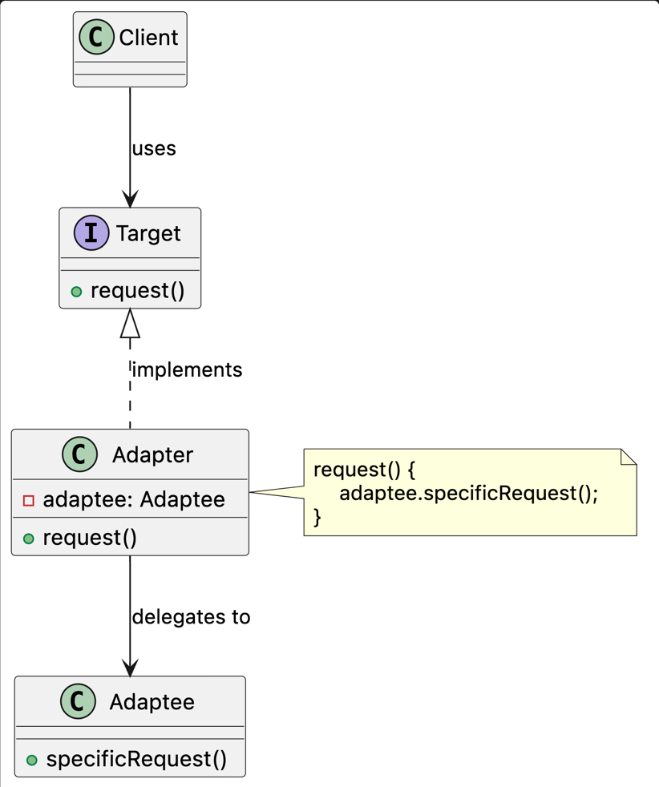

# Adapter Pattern

## Intent

Adapter converts the interface of an existing class into another interface that the client expects.

This allows classes with incompatible interfaces to collaborate without modifying the client or the existing implementation.

## Problem

A client may need to use an existing class, external library, legacy component, or third-party service whose 
interface does not match the contract expected by the application.

Making the client communicate directly with the incompatible component couples it to implementation-specific methods, data formats, and behaviors.
As new integrations are introduced, translation logic becomes duplicated and the client becomes harder to modify, test, and maintain.

This problem commonly appears through:

* Third-party libraries exposing interfaces that differ from the application's contract.
* Legacy classes that cannot be safely modified.
* External services using different method names, parameters, or response formats.
* Conversion logic duplicated across different clients.
* Large `if`, `else`, or `switch` blocks that handle implementation-specific behavior.
* Clients that depend directly on multiple incompatible implementations.

## Solution

Adapter introduces a class that implements the interface expected by the client and maintains a reference to the incompatible object.

When the adapter receives a request, it translates the request into a format understood by the existing object, delegates the operation, 
and optionally converts the result back into the format expected by the client.

The client communicates only through the target interface and remains unaware of the adapter and the adapted implementation.

Because every adapter respects the same target contract, incompatible implementations can be introduced, replaced, or removed without modifying the client.

## Structure

* **Client:** Collaborates with objects through the target interface.
* **Target:** Defines the contract expected by the client.
* **Adapter:** Implements the target interface and translates requests between the client and the adaptee.
* **Adaptee:** Provides useful behavior through an existing but incompatible interface.

## Consequences

### Benefits

* Existing or third-party code can be reused without modification.
* The client remains independent of implementation-specific interfaces.
* Translation logic is isolated in a dedicated class.
* New adaptees can be integrated by introducing new adapters.
* Existing clients do not need to change when integrations are replaced.
* Adapters can be tested independently from the client.
* The pattern supports the Single Responsibility and Open/Closed principles.

### Trade-offs

* Additional classes and abstractions increase the size of the design.
* Complex translations may make an adapter difficult to understand or maintain.
* Differences between the target and adaptee may not always map cleanly.
* Changes to the adaptee's interface may require changes to its adapter.
* Poorly designed adapters may expose implementation details and create a leaky abstraction.
* The pattern may introduce unnecessary complexity when the interface difference is small.
